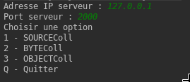
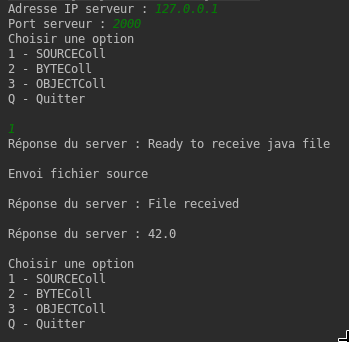

# Manuel d'utilisation de l'application
Afin d'utiliser l'application il faut d'abord s'assurer que le client et le serveur tourne sur la machine.
Pour se faire, il suffit d'executer les fichiers Server et Client. Une fois lancé coté client l'addresse IP et
le port du serveur sera demandés. Il faut rentrer 127.0.0.1 et 2000. Néanmoins, ces paramètres peuvent être modifier
dans la Classe Server. Une fois connecté le serveur indiquera qu'une nouvelle connexion a été effectuée.
 
 

Une fois la connexion faite il suffit de selectionner l'un des choix possibles illustrés ci-dessus. Le client va alors prendre
les fichiers présent sur dans le dossier files du projet, pour les options 1 et 2, et les envoyer au serveur qui pourra ensuite faire le nécessaire
en fonction du mode choisi. Dans le cas de l'envoi d'un objet le client va d'abord sérialiser l'objet dans un fichier le placer dans files
et l'envoyer au serveur. Ci-dessous un exmemple d'execution lorque l'on envoie le code source au serveur.

Pour la démonstration la classe Clac envoyée se contente de faire l'addition de 10 + 32.